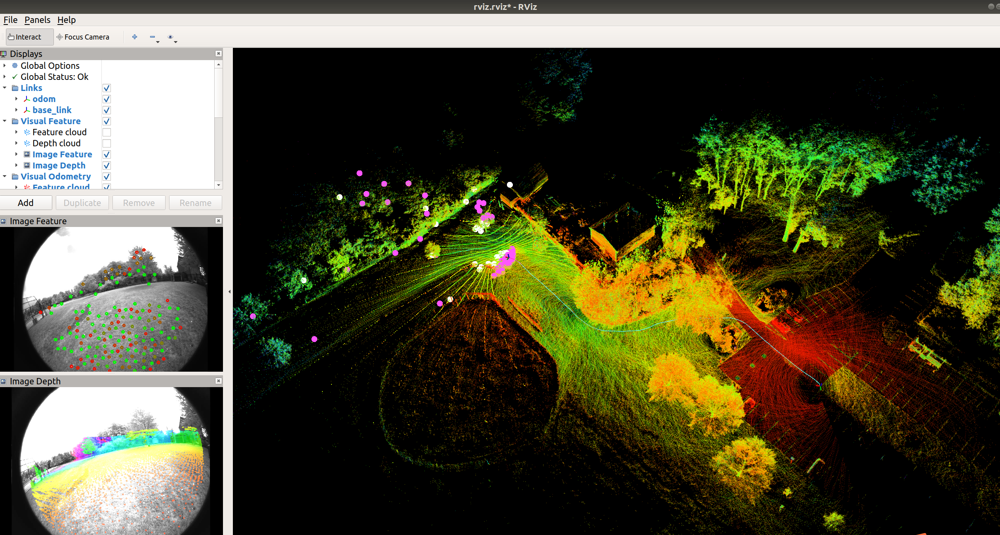

# E-LVI-SAM

This repository contains the modified code of [LVI-SAM](https://github.com/TixiaoShan/LVI-SAM) for easier using, which mainly solves the problem of ambiguous extrinsic configuration of the original LVI-SAM. Using this code, you only need to configure the extrinsic between LiDAR and IMU (**T_imu_lidar**), the extrinsic between Camera and IMU (**T_imu_camera**), and the properties of the IMU itself (**which axis the IMU rotates around counterclockwise to get a positive Euler angle output**), and then you can run LVI-SAM on different devices.

The test video on many datasets is available on **YouTube** (click below images to open) and [**Bilibili**](https://www.bilibili.com/video/BV1jv4y1Q7zr/?vd_source=1363e3b30e51ca9984f82492949f865b).

---

